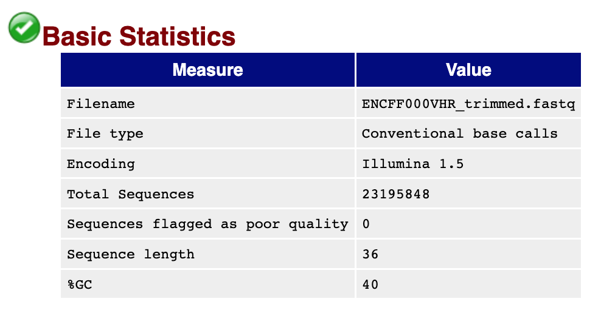
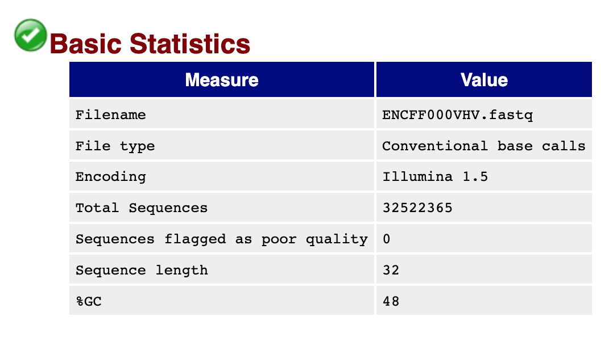
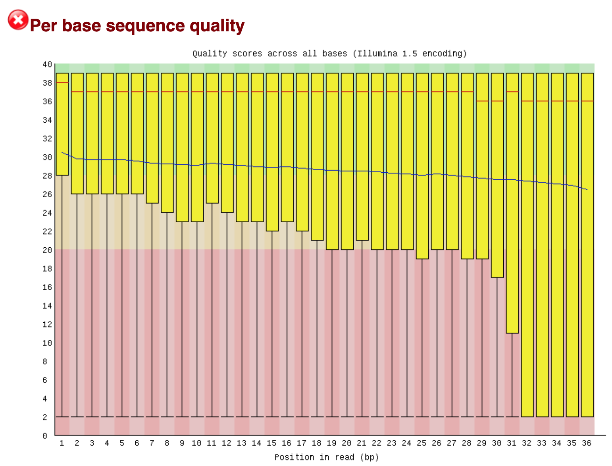
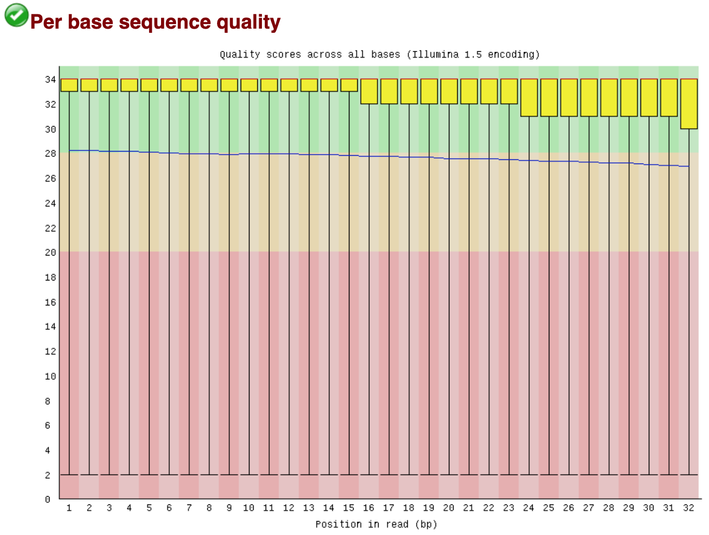
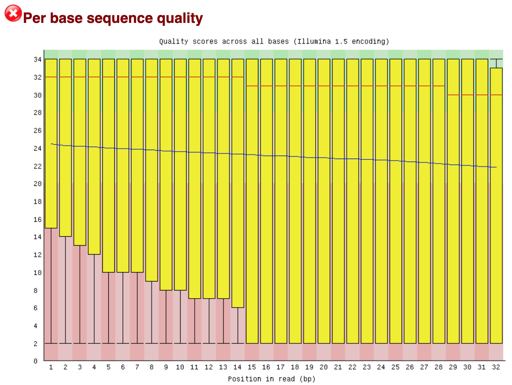
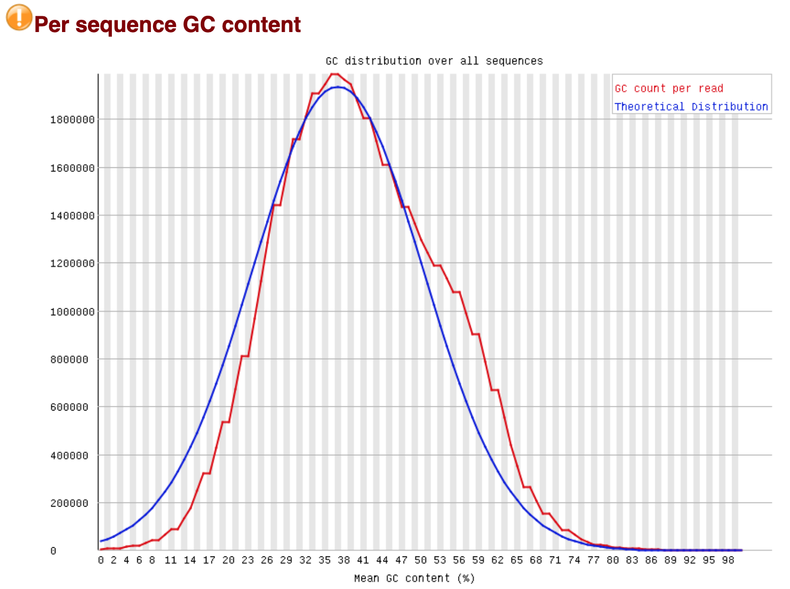
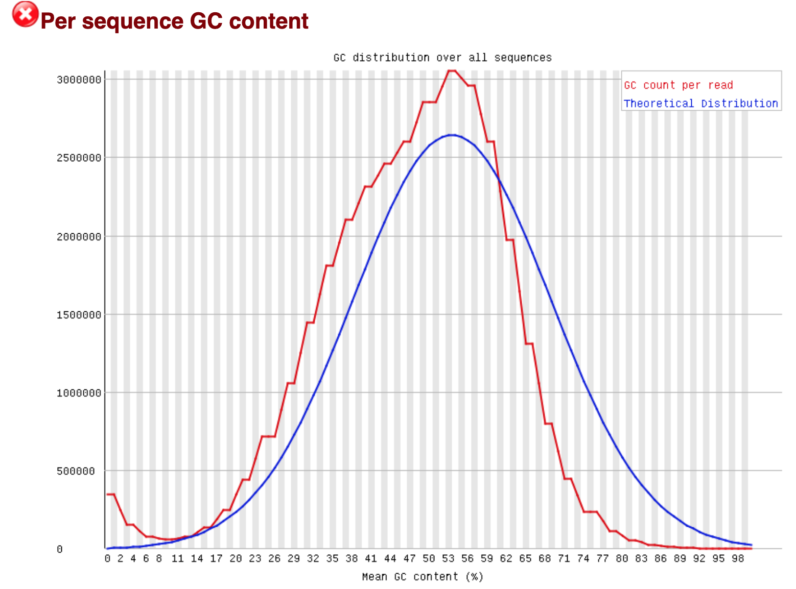
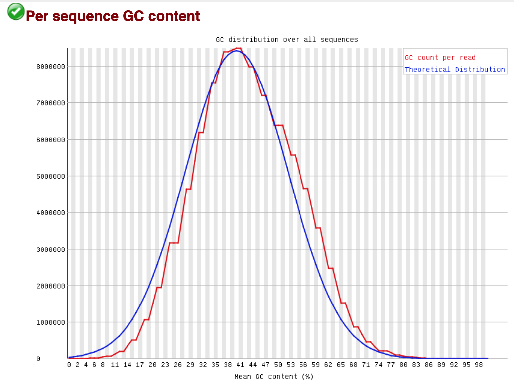
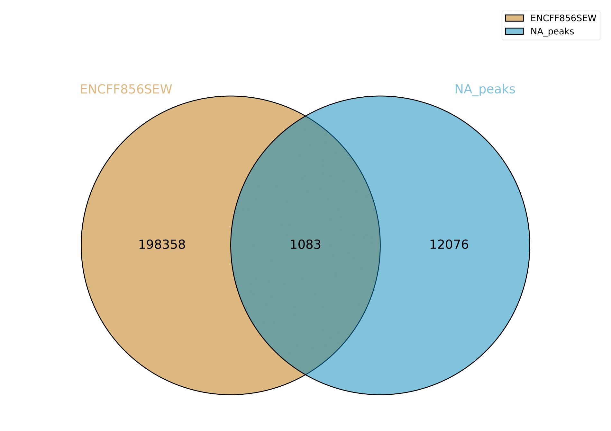
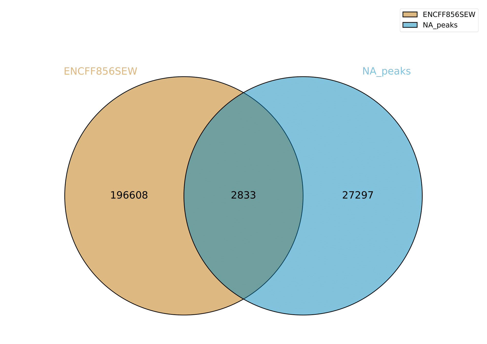

Ссылка на [коллаб](https://colab.research.google.com/drive/1BbKChjjtN3sHHsScyunUtJF_d__HtETF?usp=sharing)

Клеточная линия: NT2/D1

Гистоновая метка: H3K36me3 

## Fastq

Для ENCFF000VHR (первая реплика) – здесь было сделано подрезание через trimmomatic.

Для ENCFF000VHV (вторая реплика) – здесь никаких дополнительных действий не проводилось.

Для ENCFF000VJV (контроль) – здесь так же как для первой реплики было сделано подрезание (его результат кажется не очень хорошим, я пытался менять параметры LEADING, TRAILING, второй параметр в SLIDINGWINDOW и третий в ILLUMINACLIP, но даже при больших изменениях параметров результат не сильно отличается).

| Реплика 1 | Реплика 2 | Контроль |
|-------------------|-------------------|-------------------|
|  |  |  | 
|  |  |  | 
|  |  |  | 

## Выравнивание

Используется 14я хромосома.

| Файл | Число ридов | Не выравнялись | Выравнялись уникально | Выравнялись неуникально |
|-------------------|-------------------|-------------------|-------------------|-------------------|
| Реплика 1 | 23196491 | 20017214 (86.29%) | 767803 (3.31%) | 2411474 (10.40%) |
| Реплика 2 | 32522365 | 26642580 (81.92%) | 1048622 (3.22%) | 4831163 (14.85%) |
| Контроль |  83356386 | 72698949 (87.21%) | 2608314 (3.13%) | 8049123 (9.66%) |

Процент уникальных выравниваний мало отличается между файлами. Процент неуникальных отличается сильнее и в целом контроль показывает себя хуже, а реплика 2 лучше. Не знаю, почему это так (но можно, например, сделать вывод, что нет зависимости от размера). Проценты выравнивания в целом низкие, т.к. использовалась только одна хромосома.

## Диаграммы Венна

| Реплика 1 | Реплика 2 | 
|-------------------|-------------------|
|  |  | 
|  |  | 

Числа в целом не очень большие, т.к. ENCODE составлен по всем хромосомам, а не только по 14й. Во второй строке перебираются участки из ENCODE, а в первой – участки из реплик, поэтому в первой строке пересечений больше. Перечений также больше во втором столбце, но это связано только с тем, что во второй реплике найдено больше пиков – процент совпадений между столбцами примерно равен.
